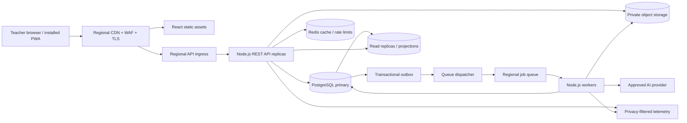

# LessonAtlas: Technical Architecture

Version: 1.0\
Date: 2026-10-05\
Status: Implementation architecture baseline\
Companions: REQUIREMENTS.md 1.1 and DESIGN.md 1.0

## 1. Purpose, authority, and assumptions

This document defines the implementation stack and production architecture for LessonAtlas, a teacher-facing lesson-planning and student-records application. REQUIREMENTS.md controls product scope, access, behavior, and acceptance; DESIGN.md controls the experience. Architecture decisions here do not authorize new product features. Requirement IDs are referenced throughout so implementation and verification can trace back to the product contract.

The application must support a globally distributed educator population and large aggregate data volume. The initial product still gives each teacher a private workspace. Global scale is achieved through partitionable workspaces and regional deployments, not by granting cross-workspace access or adding district administration. Actual student ages, customer types, jurisdictions, residency rules, retention periods, identity provider, AI provider, and hosting provider remain production decisions. Synthetic-data development may proceed before those decisions; real student data may not.

The architecture targets full WCAG 2.2 Level AA conformance and English, Spanish, and Chinese interface localization. These are release requirements, not claims that an unbuilt application already conforms. The architecture interprets “Chinese” as Simplified Chinese (`zh-Hans`) for the first translation set; Traditional Chinese (`zh-Hant`) is a separately testable locale if the product owner requires it. Academic content is stored in its authored language and is never silently translated.

## 2. Architecture principles

1. **One authoritative write path.** PostgreSQL transactions own record changes, revision history, approval decisions, and notification state. Redis and search projections are disposable derivatives.
2. **Workspace isolation at every boundary.** API, SQL, jobs, cache keys, object storage, exports, AI retrieval, metrics, and support tooling require an explicit workspace context (ACCESS-02, SEC-02).
3. **Teacher approval is a transaction.** AI can create proposals, never authoritative educational records. Acceptance checks permissions and source versions again and writes an attributable revision (AI-01, HISTORY-02, HISTORY-05).
4. **Resilience without hidden data loss.** Saves, imports, reminders, and AI requests have explicit states, bounded retries, idempotency, and recovery paths (OPS-02, AI-06, NOTIFY-02).
5. **Privacy by minimization.** Keep sensitive content out of browser persistent storage, routine logs, analytics, broad caches, and model requests unless necessary and authorized (SEC-04, SEC-05).
6. **Incremental scale.** Start with a modular Node.js service and separate workers. Split services only after measured throughput, ownership, or fault isolation demands it.

## 3. Reference deployment and data flow

The browser loads static code from a CDN and calls a same-origin `/api/v1` endpoint. Regional ingress routes authenticated traffic to the workspace's assigned home region. All authoritative writes for one workspace go to its primary database region. Workers execute in that region. A region change is an explicit migration with a controlled cutover, never an opportunistic cross-border failover. CDN assets contain no student content; authenticated API responses use `Cache-Control: private, no-store` unless a narrowly reviewed exception is documented.

### 3.1 Stack decisions

| Layer | Choice | Responsibility |
| --- | --- | --- |
| Web client | React, TypeScript, Vite | Responsive application and progressive web app shell following DESIGN.md routes and tokens. |
| Client state | Redux Toolkit, RTK Query | Global UI/session preferences, API caching and invalidation; form-local state stays in components where appropriate. No student content in persisted Redux state. |
| Routing / forms | React Router; React Hook Form plus schema validation | Route-level loading/error states, typed forms, visible validation. Exact library versions are pinned during implementation. |
| Localization | ICU message catalogs via a React i18n library; native `Intl` | Versioned messages, pluralization, locale formatting, accessible language metadata. |
| API | Node.js LTS, TypeScript, Fastify, REST over HTTPS | Domain modules, authentication, validation, authorization, and OpenAPI contracts. Pin supported releases and patch regularly. |
| Contracts | OpenAPI 3.1 and shared generated TypeScript clients; JSON Schema or Zod validation | Published request/response schemas, typed clients, runtime validation, and compatibility checks. |
| Primary store | Managed PostgreSQL | Transactions, constraints, records, revisions, outbox, and durable notification status. |
| Cache / queue support | Managed Redis | Short-lived authorized query cache, rate limits, and queue coordination. No unique authoritative student data. |
| Jobs | BullMQ workers backed by Redis, with PostgreSQL transactional outbox | Imports, exports, reminders, AI requests, projection updates, and deletion tasks. |
| Binary storage | Private, encrypted regional object storage | Temporary CSV uploads, generated exports, approved teaching assets, and backup artifacts; signed access is short lived. |
| Delivery | Docker OCI images on managed regional container orchestration | Independently scaled stateless API and workers, rolling deployments, health checks. Kubernetes is an option, not a product requirement. |
| Edge / operations | CDN, WAF, load balancer, OpenTelemetry-compatible metrics/traces | Global static delivery, abuse controls, observability, alerts. |

Use a modular monolith initially: `identity`, `workspaces`, `rosters`, `records`, `curriculum`, `lessons`, `proposals`, `groups`, `calendar`, `notifications`, `imports_exports`, and `privacy`. Each module owns its API, authorization policy, data access, and jobs. Cross-module calls use internal interfaces; the database remains one transactional system per region. Workers reuse domain services rather than creating a second, weaker authorization implementation.

## 4. Client and PWA

The React app implements the `/today`, `/lessons`, `/classes`, `/students`, `/curriculum`, `/calendar`, and `/settings` routes defined by DESIGN.md. Route loaders and RTK Query fetch paginated data. Redux stores the active workspace, locale, filters, non-sensitive UI state, and normalized query results in memory. Editor drafts use server-side draft endpoints and ETag/version checks. Keep only the unsaved editor buffer in memory while the tab is open; warn on navigation and preserve it through retry. Do not put student names, scores, profiles, contacts, lesson content, or access tokens into `localStorage`, IndexedDB, browser caches, or service-worker caches.

The PWA provides an installable manifest, icons derived from approved artwork, and an application-shell cache for versioned static assets. The service worker does not intercept or cache authenticated `/api` responses, private documents, or exports. Offline mode shows a clear unavailable state for private workflows; read/write offline synchronization is deferred because it would require a separate security and conflict design. On sign-out or session revocation, clear in-memory state, close private views, and revoke outstanding downloads where possible. The app remains usable in an ordinary browser without installation.

The UI uses semantic HTML, stable headings, visible labels, keyboard equivalents for drag actions, focus restoration, live announcements for save/proposal states, and data tables behind charts. Use tokenized contrast and focus styles from DESIGN.md. Avoid client-side HTML injection; render rich teacher/AI text through a strict sanitizer and allowed document model. Print and export views are separate, accessible renderings with student-specific details omitted unless explicitly selected (LESSON-06).

### 4.1 Localization contract

- Supported interface locale tags: `en`, `es`, `zh-Hans`. Locale selection is a teacher preference and may be changed without mutating stored records (QUALITY-06).
- Every teacher-facing string comes from versioned message catalogs, including validation, empty/error states, ARIA labels, notification text, import results, print/export labels, and email-free system notices. CI rejects missing keys and malformed ICU placeholders.
- Use `Intl.DateTimeFormat`, `Intl.NumberFormat`, and `Intl.PluralRules`; store UTC instants and IANA timezones separately. Do not localize stable standard identifiers, raw score values, CSV field names, or teacher-entered text in place.
- Set document `lang`, tag mixed-language content where known, and allow CJK line breaking and 200% text zoom without clipped controls. A translation fallback is visible in development and treated as a release defect in production.
- AI generation carries requested output language and original evidence language as separate fields. Translated interpretation must never replace the underlying source or claim a translated standard is the official version.

## 5. REST API and request lifecycle

All protected endpoints require a validated session. The API authenticates the teacher, resolves the allowed workspace, checks record ownership, validates input, executes a bounded domain operation, and returns a versioned representation. Opaque UUID/ULID IDs carry no authorization. Never accept `workspace_id` from a client as proof of membership. Prefer a workspace identifier in the route only when the server cross-checks it against the session; internal queries always include workspace scope.

Illustrative routes:

| Endpoint | Behavior |
| --- | --- |
| `GET /api/v1/classes?cursor=...` | Keyset-paginated class list with explicit filters. |
| `POST /api/v1/classes/:id/roster-imports` | Create a staged upload/validation job; no record mutation. |
| `POST /api/v1/roster-imports/:id/confirm` | Apply previewed rows with an idempotency key and precise results. |
| `GET /api/v1/students/:id/records` | Authorized, filtered evidence page; contact details use a separate endpoint. |
| `PATCH /api/v1/lessons/:id/draft` | Save a teacher draft using `If-Match`/version. |
| `POST /api/v1/lessons/:id/proposals` | Queue an AI draft or review; return job/proposal status. |
| `POST /api/v1/proposals/:id/accept` | Apply selected edited items against expected source versions in one transaction. |
| `POST /api/v1/lessons/:id/restore` | Create a new revision from a historical revision. |
| `GET /api/v1/notifications` | Paginated persisted in-app notifications. |

Use consistent problem responses with stable error codes, localization keys, field pointers, request IDs, and retryability. Do not put sensitive values or another workspace's existence in errors. Ordinary lists use keyset pagination with stable sort keys and bounded page sizes. Search is workspace scoped. For initial scale, PostgreSQL indexed search and filtered queries suffice; introduce a separate search service only when benchmarks show it is needed, then feed it from the outbox and keep it non-authoritative. Request bodies, CSV rows, export scope, and AI context have hard limits. Long operations return `202 Accepted` and a status resource. Cancellation stops future work where possible but does not roll back a committed acceptance.

Require `Idempotency-Key` for imports, acceptance, exports, and other retried commands. Store the key, principal, request hash, response, and expiry in PostgreSQL; the same key with different content is rejected. Browser autosave uses `If-Match`; a version mismatch returns `409` with current metadata and comparison data, never last-write-wins (HISTORY-05). OpenAPI examples and contract tests cover both success and denial paths.

## 6. Identity, authorization, and session design

Use an approved OIDC identity provider for teacher authentication. The provider choice remains open; production selection must meet the applicable institution and regional requirements. The API uses a server-managed session in an opaque `HttpOnly`, `Secure`, `SameSite` cookie. Rotate session identifiers after authentication, enforce idle and absolute limits, and provide server-side revocation for sign-out and incident response (ACCESS-01, ACCESS-03). Use CSRF protection for cookie-authenticated mutations, strict CORS, origin checks, and a restrictive content security policy. Do not expose bearer tokens to browser JavaScript.

Each teacher initially owns one or more private workspaces as explicitly assigned. A policy check resolves `(teacher_id, workspace_id, action, resource_id)` for every request and background job. Queries include `workspace_id`; composite foreign keys prevent cross-workspace links. PostgreSQL row-level security can provide defense in depth, but application policy remains required, and connection pooling must set and reset workspace context safely. Administrative/support access, if ever introduced, needs an explicit product requirement, separate role design, approval, audit, and customer disclosure. No implicit superuser path appears in ordinary APIs.

## 7. PostgreSQL data architecture

### 7.1 Core schemas and invariants

Use relational tables for the REQUIREMENTS.md entities: `workspaces`, `teachers`, `terms`, `classes`, `students`, `enrollments`, `contacts`, `student_contacts`, `subjects`, `units`, `objectives`, `standards`, `standard_versions`, `assessments`, `scores`, `historical_grades`, `class_sessions`, `attendance`, `notes`, `profile_entries`, `lessons`, `lesson_revisions`, `materials`, `checklist_items`, `review_findings`, `support_recommendations`, `activity_groups`, `group_memberships`, `calendar_events`, `reminders`, `notifications`, `ai_proposals`, `change_events`, `jobs`, and `outbox_events`. Every owned row has `workspace_id`, stable ID, timestamps, and a version for mutable records. Use foreign keys and unique constraints that include workspace scope.

Important constraints include one current attendance row per student/session, one current score per student/assessment when the rubric permits, valid enrollment references, unique accepted group membership per included student/activity, and explicit status values for missing/exempt/not-yet-assessed rather than coercing to zero. A standard edit creates a new `standard_version`; lesson revisions retain exact version IDs and text snapshots. Taught lessons retain `taught_revision_id`. Grade scales, periods, evidence dates, and provenance are immutable facts in the associated historical event (RECORD-01–05, CURR-04, LESSON-05).

Lesson revisions and teaching materials are immutable snapshots. Current lesson metadata points to the latest revision. Academic corrections create new values and corresponding `change_events` with actor, time, previous/current values where retention allows, and reason. Restore creates another lesson revision. AI proposals store input record IDs and versions, model/provider/config identifier, permitted output type, explanation, evidence references, status, and approving teacher. Acceptance runs inside one PostgreSQL transaction: lock relevant rows, re-check ownership and input versions, validate only selected edits, write new revision/records, write change events, update proposal state, and enqueue outbox events. A stale item cannot be applied (AI-01–05, HISTORY-01–06).

### 7.2 Denormalization and scale

Normalize authoritative facts first; selectively denormalize read paths. Maintain workspace-scoped projection tables for Today counts, class roster summaries, lesson preparation counts, curriculum coverage, and student progress summaries. Each projection records its source version or processing watermark so the UI can disclose freshness. Use transactional updates for small, correctness-critical counters and outbox-driven rebuildable projections for larger aggregates. A delayed projection never changes whether a save or acceptance succeeded. Evidence links in summaries always resolve to authoritative rows.

Index common predicates such as `(workspace_id, class_id, date, id)`, `(workspace_id, student_id, evidence_date, id)`, `(workspace_id, lesson_id, revision_number)`, and `(workspace_id, status, due_at, id)`. Use `EXPLAIN` and representative seeded data before adding indexes. Partition append-heavy `change_events`, notifications, and time-series academic records by time and, where useful, a workspace hash; avoid partitioning every small table. Read replicas serve eligible bounded-staleness lists and reporting, while post-write reads, conflict resolution, and approval checks use the primary. Connection pools cap per-replica concurrency; migrations are backward compatible and staged.

At much larger scale, assign workspaces to regional database cells. A directory maps workspace ID to home cell. Cell placement is part of the residency decision, and a workspace migration requires verified copy, freeze/cutover, cache invalidation, and audit. Cross-cell joins are prohibited; aggregate operational metrics contain no student content. This avoids a single global write database and lets capacity grow by adding cells. A single large workspace must still pass the reference load in QUALITY-02; workspace sharding alone is not a substitute for good queries.

## 8. Redis, queues, and asynchronous processing

Redis stores only short-lived, workspace-namespaced cache entries and queue/rate-limit metadata. Cache keys include region, workspace, resource type, ID/query hash, and schema version. Never cache contacts, profile notes, full student records, or AI prompts by default. Where an authorized cache is useful, set a short TTL, encrypt transport, restrict network access, and invalidate on outbox events. A cache miss or Redis outage falls back to PostgreSQL within overload limits; it cannot reveal stale permissions. Rate limits apply at edge, account, workspace, and costly job types without using student identifiers in metrics.

PostgreSQL's transactional outbox bridges durable writes to queues. A dispatcher publishes outbox IDs to BullMQ; workers claim idempotent jobs and persist terminal state in PostgreSQL. Redis queue loss is recovered by replaying undelivered outbox rows. Jobs are at-least-once; each handler uses stable job IDs, deduplication keys, bounded exponential retries, poison-job handling, and explicit cancellation states. Keep import validation, import commit, exports, AI calls, projection refresh, reminders, and retention deletion in separate queues with independent concurrency and budgets. No external side effect is assumed exactly-once.

Reminder scheduling derives from authoritative calendar and checklist records. Store recurrence rule, IANA timezone, local intended time, occurrence exceptions, and source version; materialize a bounded future window. Reschedule/cancel invalidates pending deliveries and creates a new generation key. Notification insertion has a unique `(workspace_id, source_id, occurrence_id, generation, lead_time)` key so retries cannot duplicate a reminder. Persist unread/snoozed/overdue state for users who were signed out (CAL-03, NOTIFY-01–03). Initial delivery is in-app only.

## 9. AI processing boundary

AI is an optional, isolated workflow. A teacher explicitly chooses a task and scope; the API records a job and retrieves only same-workspace, relevant, authorized evidence. Contact details are excluded. The job creates a bounded provider request through a provider adapter with per-region configuration, timeouts, cancellation, quotas, and an approved data-use/retention policy. AI is disabled for real student content until the institution's authority and provider terms are documented (SEC-05).

Treat teacher notes, standards, and pasted documents as untrusted data. They may inform the task but cannot modify system instructions, select tools, widen retrieval, trigger exports, or approve changes. Use a strict output schema and allowlisted edit operations. Validate record references, standard/version identifiers, student membership, HTML/Markdown, and evidence citations against server data before presenting a proposal. Unsupported claims are rejected or marked for teacher review. Store source facts separately from generated interpretations, surface age and gaps in evidence, and never infer capability from absence or a missing score (AI-03–08, MATCH-05).

Group generation uses a deterministic constraint validator and assignment service for inclusion, once-only membership, locks, and together/apart constraints. AI may suggest rationale or a candidate assignment, but the validator decides feasibility. Acceptance attaches a validated grouping to one lesson activity. This keeps constraint integrity testable even if the model changes (GROUP-01–04).

## 10. Accessibility architecture

The target is all applicable Level A and AA success criteria in [WCAG 2.2](https://www.w3.org/TR/WCAG22/), across desktop, tablet, compact layouts, all supported locales, and print/export views where they are web content. Component libraries are evaluated by actual behavior, not their marketing claims. The shared design system supplies labeled inputs, error associations, focus indicators, dialogs, menus, tables, and status announcements so each screen does not reimplement accessibility differently.

Test the workflows most likely to fail: keyboard attendance entry; score status versus zero; drag alternatives for grouping, reordering, and calendar moves; focus not obscured by sticky UI; 200% zoom and reflow; target size; accessible authentication; language of page/parts; autosave and AI status messages; and evidence drawers that return focus. Automated checks run in CI, but release requires manual keyboard and screen-reader tests with at least one representative browser/screen-reader combination per platform and locale review. Color and contrast are checked in all component states. Defects block release when they prevent the WCAG target or a core workflow (QUALITY-01).

## 11. Privacy, security, and children's data

The application handles education records and potentially children's data, so production onboarding starts with a jurisdiction and customer-role assessment. No one law applies globally by default. For US school use, review FERPA obligations and vendor control terms with the institution; assess COPPA applicability and school/parent authorization where relevant. For EU/UK use, determine controller/processor roles, lawful basis, child-specific safeguards, transfer mechanisms, and whether a data protection impact assessment is required. For other regions, document applicable education, child privacy, and residency obligations before enabling that region. Product language availability does not imply legal availability in a jurisdiction. The [US Department of Education vendor guidance](https://studentprivacy.ed.gov/resources/responsibilities-third-party-service-providers-under-ferpa), [FTC COPPA guidance](https://www.ftc.gov/business-guidance/resources/complying-coppa-frequently-asked-questions), and [UK ICO edtech guidance](https://ico.org.uk/for-organisations/uk-gdpr-guidance-and-resources/childrens-information/childrens-code-guidance-and-resources/the-children-s-code-and-education-technologies-edtech/) inform this assessment; counsel and institutional policies determine the actual deployment controls.

Before real student data, record the customer/institution authority, purposes, categories, approved subprocessors and AI provider, processing locations, transfer basis, retention schedule, deletion process, incident contacts, and access/export responsibilities. Default to no advertising pixels, third-party analytics on authenticated pages, public student links, model training on student content, or unnecessary contact disclosure. Separate contact information from routine lesson/evidence payloads. A teacher's ability to enter a record does not itself prove an institution approved this service for all student data.

Encrypt all transport with modern TLS and data at rest using managed keys; protect backups and object storage with region-appropriate keys and least-privilege access. Keep credentials in a secrets manager, rotate them, and never expose them to client bundles. Use parameterized queries, strict request validation, safe output rendering, CSV formula neutralization, antivirus/content-type checks for uploads, size limits, and egress allowlists. Apply security headers, CSP, CSRF defenses, WAF rules, dependency scanning, container scanning, SBOM generation, and reviewed image provenance. Audit security-sensitive operations without logging student content. Logs and traces use opaque IDs and redact URLs, request bodies, prompts, contacts, notes, and exports (SEC-01–04, SEC-07–08).

Retention and deletion are policy-driven per jurisdiction/customer agreement. A deletion job traverses current records, immutable revisions/history fields, AI proposals, projections, caches, temporary uploads, generated exports, search indexes, and provider-held copies. Retain only legally permitted event metadata after purging content. Backup retention is bounded; restoration runs a deletion replay ledger before the recovered service can serve traffic so purged data does not reappear (SEC-06, HISTORY-06). Verify deletion on synthetic fixtures and document exceptions that law requires.

## 12. Reliability, observability, and global capacity

Run stateless API replicas across multiple availability zones in each enabled region. Use managed PostgreSQL high availability, encrypted backups, tested point-in-time recovery, Redis failover, and durable regional object storage. Regional failures should show a controlled unavailable state; do not silently route student data to an unapproved region. Define production RPO/RTO with the customer and test a restore before go-live (OPS-01). Availability objectives and capacity budgets are measured per region and service class, rather than promising unlimited scale.

Start performance testing with the REQUIREMENTS.md reference workspace: 20 classes, 600 active students, 2,000 lessons, 100,000 academic/attendance records, and 25 concurrent teachers. Ordinary paginated reads/saves target p95 under two seconds in a documented environment; AI, imports, and exports have separate queue-latency and completion objectives (QUALITY-02–04). Test a larger multi-workspace regional load for noisy-neighbor behavior, rate-limit fairness, connection saturation, queue backlog, replica lag, and cache loss. Scale API replicas by request saturation, workers by queue depth and provider quota, and database cells by measured storage/IOPS/CPU headroom. Capacity planning includes seasonal spikes around term starts and grading periods.

Telemetry records request rate, latency, error rate, queue age, worker retry/dead-letter counts, outbox lag, database locks and replica lag, cache hit rate, and per-region capacity. Trace IDs cross API and jobs without sensitive payloads. Alert on failed saves, stale outbox, notification delay, backup/restore failure, unauthorized-access spikes, and AI provider failure. Use synthetic probes for sign-in, class view, lesson save, and notification flow. Incident runbooks cover compromised session, regional outage, queue loss, migration rollback, and privacy breach triage.

## 13. Build, deployment, and release gates

Use a monorepo with `apps/web`, `apps/api`, `apps/worker`, `packages/contracts`, `packages/ui`, and `packages/i18n`. This is an implementation layout, not a separate service mandate. Docker multi-stage builds produce minimal non-root images. CI checks formatting, type safety, lint, unit/domain tests, OpenAPI compatibility, localization completeness, dependency and image scans, and accessibility automation. Integration tests run against PostgreSQL and Redis containers with synthetic data. End-to-end tests cover the release scenarios in REQUIREMENTS.md Section 12, including cross-workspace denial, stale AI acceptance, import retry, DST reminders, deletion replay, and manual workflow when AI is down.

Deployment uses infrastructure as code, separate environments, managed secrets, immutable image digests, and staged rollouts. Run backward-compatible database migrations before switching API replicas; contract checks prevent old and new versions from interpreting records differently. Feature flags may hide unfinished AI or regional capabilities but cannot bypass authorization. Rollback must account for schema compatibility and queued jobs. Production release needs documented privacy decisions, approved provider contracts, WCAG 2.2 AA verification, translated locale review, load results, restore exercise, and a tested deletion path. No real student data is used in CI or demos.

## 14. Decisions remaining before production

| Decision | Required outcome |
| --- | --- |
| Target jurisdictions, student ages, and customer types | Legal applicability matrix, onboarding restrictions, and region availability. |
| Institution authority and contracts | Data stewardship, permitted processing, roles, subprocessors, privacy notices, and support access rules. |
| Home regions and hosting provider | Residency map, backup locations, cross-border transfer controls, and regional failure policy. |
| Identity provider | OIDC integration, account recovery, MFA policy, institutional federation needs, session limits. |
| AI provider and model | Approved terms, no-training setting, retention/deletion, allowed fields, location, evaluation baseline. |
| Retention and recovery | Record lifetimes, export expiry, backup window, deletion SLA, RPO/RTO. |
| Chinese locale scope | Confirm `zh-Hans` alone or both `zh-Hans` and `zh-Hant`; commission education-domain review. |
| Operational scale targets | Expected users/regions, traffic peaks, availability objective, cell size, and cost envelope. |

## 15. Traceability and source notes

This architecture implements ACCESS-01–03, SEC-01–08, OPS-01–02, QUALITY-01–06, AI-01–08, HISTORY-01–06, and the relevant functional IDs cited above. The implementation backlog and meaningful acceptance tests must cite the corresponding requirement IDs. Any change to product scope or behavior first updates REQUIREMENTS.md and its change log. This document should be revised when a production decision above is made or a load/security test changes an architectural assumption.

External references are architecture inputs, not a compliance certification: [WCAG 2.2](https://www.w3.org/TR/WCAG22/); [US Department of Education FERPA guidance for service providers](https://studentprivacy.ed.gov/resources/responsibilities-third-party-service-providers-under-ferpa); [FTC COPPA FAQ](https://www.ftc.gov/business-guidance/resources/complying-coppa-frequently-asked-questions); [UK ICO guidance on edtech and children's data](https://ico.org.uk/for-organisations/uk-gdpr-guidance-and-resources/childrens-information/childrens-code-guidance-and-resources/the-children-s-code-and-education-technologies-edtech/).

### Change log

| Version | Date | Change |
| --- | --- | --- |
| 1.0 | 2026-10-05 | Initial technical architecture aligned to REQUIREMENTS.md 1.1, DESIGN.md 1.0, and product-owner stack, accessibility, localization, global-scale, and privacy direction. |
