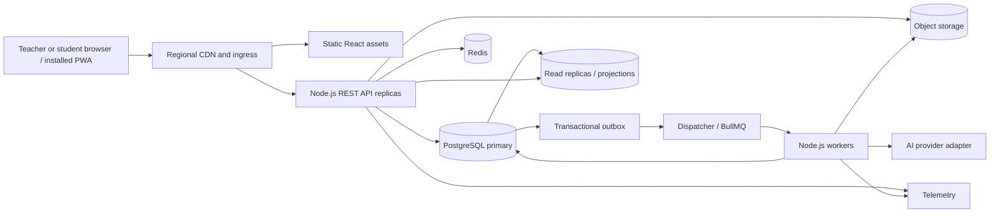

# LessonAtlas: Architecture

This file owns component structure, interfaces, data flow, and technology decisions. Behavior: [REQUIREMENTS.md](REQUIREMENTS.md). Visual conventions: [DESIGN.md](DESIGN.md). Boundary enforcement: [SECURITY.md](SECURITY.md).

## DEP-01 — Deployment and outstanding choices

Use regional deployments and partitionable workspaces for global aggregate scale. Hosting, identity and AI providers, enabled regions, and database-cell capacity remain TO BE DECIDED under SECURITY.md production gates. Capacity objectives belong to REQUIREMENTS.md QUALITY-02–03 and its open decisions.

The browser uses same-origin `/api/v1`. Ingress routes a workspace to its home region; its primary handles authoritative writes and regional workers execute jobs. A directory maps workspaces to database cells. Moving a workspace uses a verified copy, freeze/cutover, and cache invalidation. There are no cross-cell joins. SEC-OPS-02 owns residency enforcement.

## DEP-02 — Stack and module boundaries

| Layer | Choice and rationale |
| --- | --- |
| Web | React 19, TypeScript, Vite; client-rendered responsive PWA shell. |
| Client state | Redux Toolkit and RTK Query for UI/session preferences, normalized query results, API caching and invalidation; component-local form state. Storage restrictions: SEC-WEB-02. |
| Routing/forms | React Router and React Hook Form with schema validation; route loading/error states and typed forms. |
| Localization | Versioned ICU message catalogs through a React i18n library; native `Intl.DateTimeFormat`, `Intl.NumberFormat`, and `Intl.PluralRules`. Locale coverage: QUALITY-06. |
| API | Node.js, TypeScript, Fastify; REST and OpenAPI 3.1 with generated TypeScript clients, JSON Schema or Zod runtime contracts. Initial runtime choice: Node.js 24; a Node.js 26 transition requires compatibility and SEC-NODE-01 review. |
| Data | Managed PostgreSQL for transactions, revisions, durable job/notification state, and outbox; Redis for disposable caches, rate-limit metadata, and queue coordination. |
| Jobs | BullMQ with a PostgreSQL transactional outbox; separate Node.js workers. |
| Binary storage | Regional object storage for temporary CSVs, exports, teaching assets, and backups. Controls: SEC-DATA-02–03. |
| Delivery | Docker OCI images on managed regional container orchestration; Kubernetes optional. CDN, WAF, load balancer, OpenTelemetry-compatible metrics/traces. |

Start with a modular monolith: `identity`, `workspaces`, `rosters`, `records`, `curriculum`, `lessons`, `proposals`, `groups`, `calendar`, `notifications`, `imports_exports`, and `privacy`. Each module owns its API, policy integration, data access, and jobs; cross-module calls use internal interfaces. Workers reuse domain services. Split services only when measured throughput, ownership, or fault isolation warrants it.

Monorepo layout: `apps/web`, `apps/api`, `apps/worker`, `packages/contracts`, `packages/ui`, and `packages/i18n`.

## DEP-CLIENT-01 — Client and PWA

Route structure and component layout are owned by DESIGN.md. Route loaders/RTK Query retrieve paginated data. Editor drafts use server endpoints and ETag/version checks. A manifest and icons accompany a versioned static application-shell cache implementing REQUIREMENTS.md QUALITY-07.

Shared UI components implement DESIGN.md DR-A11Y-01. Print/export renderers are separate from application navigation. Localization uses catalog keys for all interface text. UTC instants and IANA timezones are stored separately; raw scores, standard identifiers, CSV field names, and authored text are not localized in place. AI request contracts carry output language and evidence language as separate fields.

## DEP-API-01 — REST contracts

Authentication and authorization enforcement: SECURITY.md SEC-AUTH-01–08 and SEC-AZ-01–04.

| Illustrative endpoint | Contract |
| --- | --- |
| `GET /api/v1/classes?cursor=...` | Keyset-paginated class list. |
| `POST /api/v1/classes/:id/roster-imports` | Staged upload/validation job. |
| `POST /api/v1/roster-imports/:id/confirm` | Commit command with idempotency key. |
| `GET /api/v1/students/:id/records` | Filtered evidence page. |
| `PATCH /api/v1/lessons/:id/draft` | `If-Match`/version-based save. |
| `POST /api/v1/lessons/:id/proposals` | Job/proposal status resource. |
| `POST /api/v1/proposals/:id/accept` | Selected edits and expected source versions. |
| `POST /api/v1/lessons/:id/restore` | Revision creation command. |
| `GET /api/v1/notifications` | Paginated persisted notifications. |

Problem responses carry stable error codes, localization keys, field pointers, request IDs, and retryability; disclosure policy is SEC-NODE-03. Lists use bounded keyset pagination and stable sort keys. PostgreSQL indexed search is the initial search implementation; a separate search projection is introduced only after benchmarks justify it and is fed by the outbox.

Long operations return `202 Accepted` and a status resource. Cancellation stops future work where possible and cannot undo a committed transaction. Retried commands, including imports, acceptance, and exports, use `Idempotency-Key`; PostgreSQL stores key, principal, request hash, response, and expiry. Reuse with different content is rejected. Autosave version conflicts return `409` with current metadata and comparison data (HISTORY-05).

## DEP-DATA-01 — Persistence and transactions

Relational tables: `workspaces`, `teachers`, `terms`, `classes`, `students`, `enrollments`, `contacts`, `student_contacts`, `subjects`, `units`, `objectives`, `standards`, `standard_versions`, `assessments`, `scores`, `historical_grades`, `class_sessions`, `attendance`, `notes`, `profile_entries`, `lessons`, `lesson_revisions`, `materials`, `checklist_items`, `review_findings`, `support_recommendations`, `activity_groups`, `group_memberships`, `calendar_events`, `reminders`, `notifications`, `ai_proposals`, `change_events`, `jobs`, and `outbox_events`.

Rows use stable IDs and timestamps; mutable rows have versions. Workspace relationships and scope constraints are owned by SEC-AZ-02. Schema fields implement the corresponding REQUIREMENTS.md entity families. Workspace preferences include timezone and notifications; terms have date ranges; changes include their related revision and optional reason. One current score per student/assessment is enforced where the rubric permits.

Lesson/material revisions are immutable snapshots; current metadata points to the latest revision. Standard versions include text snapshots and lessons retain their exact references; taught lessons store `taught_revision_id`. Change events retain grade scale, period, evidence date, and provenance. Retention of all historical content follows SEC-DATA-05.

Proposal storage includes input IDs/versions, model/provider/config identifier, output type, explanation, evidence references, status, and approving actor. Acceptance locks relevant rows, invokes SEC-AZ-03, writes selected records/revisions and change events, updates proposal state, and creates outbox events in one PostgreSQL transaction.

## DEP-SCALE-01 — Projections and capacity

Normalize authoritative facts. Rebuildable workspace projections serve Today counts, roster summaries, preparation counts, curriculum coverage, and progress. Each stores a source version/watermark; small correctness-critical counters update transactionally, larger aggregates through the outbox. Evidence links resolve to authoritative rows. Projection freshness behavior: REQUIREMENTS.md FR-05.

Index measured predicates such as `(workspace_id, class_id, date, id)`, `(workspace_id, student_id, evidence_date, id)`, `(workspace_id, lesson_id, revision_number)`, and `(workspace_id, status, due_at, id)`. Use representative seeds and `EXPLAIN`. Partition append-heavy change events, notifications, and academic time series by time and optionally workspace hash. Read replicas serve bounded-staleness lists/reporting; post-write reads, conflicts, and acceptance use the primary. Cap connection-pool concurrency.

Scale stateless API replicas by saturation, workers by queue depth/provider quota, and database cells by storage/IOPS/CPU headroom. Test multi-workspace noisy-neighbor behavior, fairness, connection saturation, backlog, replica lag, cache loss, and seasonal peaks against QUALITY-02–03.

## DEP-JOBS-01 — Queues and recurrence

Redis cache keys combine the scope required by SEC-AZ-02 with resource type, ID/query hash, and schema version; outbox events invalidate derivatives. Cache loss falls back to PostgreSQL within overload limits. Cache content and access policy: SEC-OPS-02.

The dispatcher publishes outbox IDs to BullMQ. Workers claim idempotent jobs and persist terminal state in PostgreSQL. Queue loss replays undelivered outbox rows. Delivery is at least once: handlers use stable job IDs, deduplication keys, bounded exponential retries, poison-job handling, and cancellation states. Import validation/commit, exports, AI, projections, reminders, and retention deletion use separate queues with independent concurrency/budgets.

Recurrence stores rule, IANA timezone, intended local time, exceptions, and source version; materialize a bounded future window. Reschedule/cancel creates a new generation key. Notification insertion uses unique `(workspace_id, source_id, occurrence_id, generation, lead_time)` keys to implement NOTIFY-02. Notification status persists in PostgreSQL.

## DEP-AI-01 — AI integration

The API records a task/scope job, retrieves evidence through the domain service, and invokes a regional provider adapter with timeouts, cancellation, and quotas. SECURITY.md SEC-DATA-04 owns disclosure and output enforcement; REQUIREMENTS.md owns proposal behavior.

A deterministic assignment service and constraint validator checks group feasibility independently of model output. AI can supply a candidate or rationale; the validator implements GROUP-01–04 before acceptance attaches the grouping to its activity.

## DEP-OPS-01 — Reliability and deployment

Run API replicas across availability zones, managed PostgreSQL high availability and point-in-time recovery, Redis failover, and durable object storage. Regional failures expose unavailable status under SEC-OPS-02 residency constraints; OPS-01 owns recovery objectives.

Measure request rate/latency/errors, queue age, retries/dead letters, outbox lag, DB locks/replica lag, cache hits, and regional capacity. Trace IDs propagate through API/jobs under SEC-OPS-03. Alerts include failed saves, stale outbox, delayed notifications, and provider failures. Synthetic probes cover sign-in, class view, lesson save, and notification flow.

Deployment controls: SECURITY.md SEC-OPS-01. Backward-compatible migrations precede replica switching; contract checks cover mixed versions. Rollback accounts for schema and queued jobs. CI operating rules are in CLAUDE.md; release criteria are owned by REQUIREMENTS.md and SECURITY.md.

## DEP-ACCESS-01 — Teacher/student boundary (T-2, T-3, T-4, T-10, T-12, T-18, T-23, T-24)

Identity resolves an authenticated principal independently of the student educational record. The identity module supplies principal and role; the domain service resolves the approved student-record/enrollment relationship before producing a recipient representation. Logical path: browser → API identity context → domain policy → scoped data/projection → recipient response. Domain services also supply the same policy context to workers and provider adapters. Enforcement is owned by SECURITY.md SEC-AUTH-08 and SEC-AZ-04.

No new service is assumed. The exact identity binding schema, student route/interface contracts, and export delivery/revocation mechanism remain TO BE DECIDED under SQ-01–04. Student clients do not inherit teacher route payloads; recipient contracts must be defined before those interfaces are implemented. Existing teacher-private workspace ownership remains the data partition model.

Traceability: FR-01–05 use this boundary and DEP-SCALE-01; SECURITY.md owns the associated threat/control and verification mappings.
